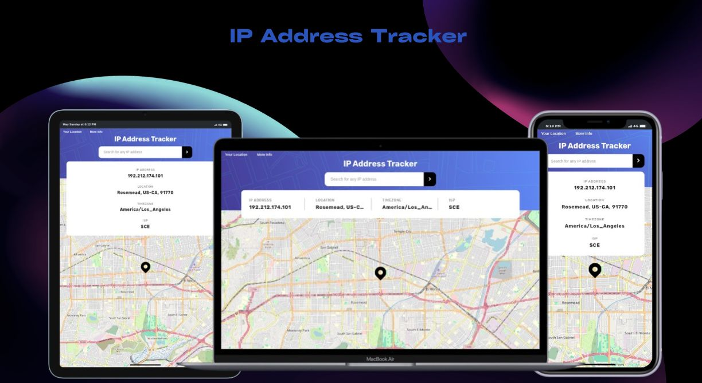

<h1 align="center">Frontend Mentor - IP address tracker</h1>
<div align="center">
  <a href="#descrição">Descrição</a> |
  <a href="#iniciar">Iniciar</a> |
  <a href="#licença">Licença</a>
</div>



## Descrição

A aplicação e uma pagina para buscar visualizar a localização no mapa, por meio do IP, tendo como acessar sua localização, de maneira fácil e rápida na opção **Your location** ou pesquisar por outra digitando o IP, para localizar a origem dele. Acesse mais detalhes da localização na opção **More Info** no topo da pagina.

Os dados vem de uma api publica chamada **[getgeoapi.com](https://getgeoapi.com/)**.

As principais funções do site são:

- busca por localização do usuário, usando o IP
- Pode se buscar inserindo o IP no campo, Ou clicando e **Your Location**
- Acessar mais detalhes da localização atual acessando **More Info**
- Compartilhamento de estado da pagina entre usuários, usando a url como meio de acesso

Acesse o site **[IP Address Tracker](https://matheus369k.github.io/ip-address-tracker/)**.

## Iniciar

E Necessario ter o Nodejs e o git instalado.

Faça clone do repositório localmente.

```bash
git clone https://github.com/matheus369k/ip-address-tracker.git
cd ./ip-address-tracker
```

Instale as dependências

```bash
yarn
```

Crie um arquivo **.env**, com as variáveis ambientes abaixo

```bash
GEO_API_URL="https://api.getgeoapi.com/v2/ip/"
GEO_API_KEY="393284k343b232v21ds4ad9a6da96as8a6a"
```

Agora você pode iniciar o projetos

```bash
yarn start
```

## Licença

Licença usada **[MIT](./LICENSE.txt)**
